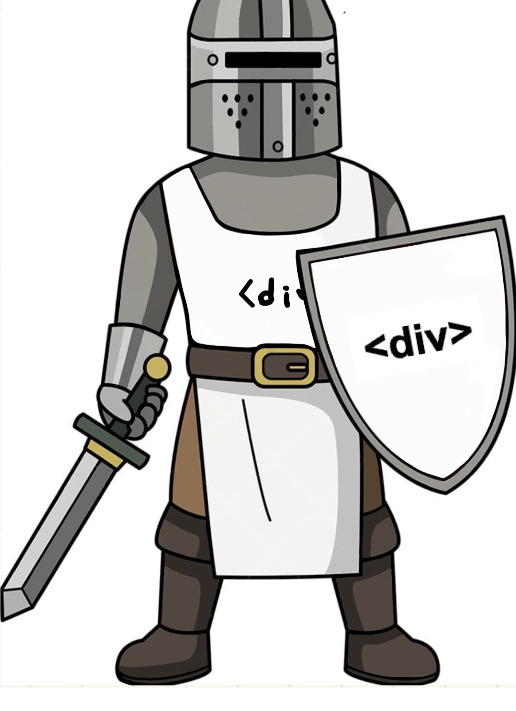

# Tarot, but Game

<p style="text-align:center;">
    The CSS Crusaders (Team 17)<br>
    
</p>

[Tarot, but Game (link to web version of the project)](https://cse110-team17.github.io/cse110-sp23-group17/source/)

[JSDocumentation](https://cse110-team17.github.io/cse110-sp23-group17/out/)

[Our Team Page](/admin/team.md) | [Our Team Video](https://www.youtube.com/watch?v=jR47GaIusic&ab_channel=KristinE)

[Private video](https://youtu.be/FqfbOe_-QS0)

[Public video](https://youtu.be/BD69aKURB_E)

## Project Overview


Welcome to Tarot, but Game repository! **Tarot, but Game** introduces a **gameplay experience** to getting **tarot card fortunes!** 

Our team created a Tarot card fortune telling web application that improves the user experience by making it **more fun and interesting**. You will be able to go on a journey where you can learn about tarot cards, choose your character and meet a tarot fortune teller who will reveal your fortune. Here, you will be able to find our source code in `./source/` and documentations throughout our repository. The overview of documentation locations are listed below.

### Documentation Location
- ADRs: `./specs/adrs`
- Team Meeting Notes: `./admin/meetings`
- Pitch Documents: `./specs/pitch`
- Brainstorming Documents `./specs/brainstrom`
- CI/CD Pipeline: `./.github/workflows` and `./admin/cipipeline`
- Videos: `./admin/vidoes`

## How to Locally Build and Test
### Clone the repo
```shell
# Clone repo
git clone git@github.com:CSE110-Team17/cse110-sp23-group17.git
# Change working directory
cd se110-sp23-group17
```

### Install all dependencies
```shell
# If you don't have node, check https://nodejs.dev/en/learn/how-to-install-nodejs/ to install
# How to check if you have node installed (MacOS)
node -v
# If you have node, install dependencies. This action will create package.json and package-lock.json
npm install
```

### Running Tests, JSDocs, ESLint
```shell
# Run Tests
npm run test

# Run JSDocs
npm run jsdoc

# Run ESLint
npm run lint 
```

### Building the web application
Use Visual Studio Code Live Server extension. If you don't have it you can install it [here](https://marketplace.visualstudio.com/items?itemName=ritwickdey.LiveServer)

## How to Contribute
If you have a feature you wish to add or changes you wish to make, we are accepting suggestions on our [Feature Requests Form](https://tarot-but-game.canny.io/feature-requests)

## License


